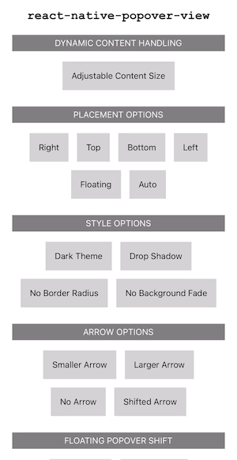

## react-native-popover-view

[](https://npmjs.org/package/react-native-popover-view "View this project on npm")
[](https://npmjs.org/package/react-native-popover-view "View this project on npm")
[](https://npmjs.org/package/react-native-popover-view "View this project on npm")

A well-tested, adaptable, lightweight `<Popover>` component for react-native with no dependencies.  Tested and working on iOS and Android.  May work on Web, but not officially supported.

It is written entirely in TypeScript and uses [React Native's native driver](https://reactnative.dev/docs/animations#using-the-native-driver) for responsive animations, even when the JS thread is busy.



[Open the snack](https://snack.expo.dev/@steffeydev/react-native-popover-view) to play with all the features!

##### Table of Contents
* [Features](#features)
* [Installation](#installation)
* [Usage](#usage)
* [Props](#props)
* [Usage with Safe Area Context](#safeArea)
* [Troubleshooting](#troubleshooting)
* [Upgrading](#upgrading)
* [Contributing](#contributing)
* [Credits](#credits)

## <a name="features"/>Popover Features
* **Simple**: By default the popover will float in the center of the screen, but if you choose to anchor it to a view (like a `Touchable`) or to a point on the screen, it will automatically find the best placement to accommodate the popover content.
* **Customizable**: Tweak everything, including the popover and arrow style, placement heuristics, animation configuration, and more.
* **Adaptable**: Popover adapts to changing content size, screen size, and orientation, and will move to accomidate the on-screen keyboard for text input into the popover.

## <a name="installation"/>Installation

```shell
npm i react-native-popover-view
```
or
```shell
yarn add react-native-popover-view
```

## <a name="usage"/>Usage

### Showing popover from an element

For the simplest usage, just pass your `Touchable` into the `from` prop.  The `Popover` will automatically be shown when the `Touchable` is pressed.

```jsx
import React from 'react';
import Popover from 'react-native-popover-view';

function App() {
  return (
    <Popover
      from={(
        <TouchableOpacity>
          <Text>Press here to open popover!</Text>
        </TouchableOpacity>
      )}>
      <Text>This is the contents of the popover</Text>
    </Popover>
  );
}
```
Note that if you pass an `onPress` or `ref` prop to the `Touchable` it will be overwritten.

### Showing popover from an element (advanced)

For more advanced usage, pass in a function that returns any React element.  You control which element the popover anchors on (using the `sourceRef`) and when the popover will be shown (using the `showPopover` callback).  In this example, the `Popover` will appear to originate from the text _inside_ the popover, and will only be shown when the `Touchable` is held down.

```jsx
import React from 'react';
import Popover from 'react-native-popover-view';

function App() {
  return (
    <Popover
      from={(sourceRef, showPopover) => (
        <View>
          <TouchableOpacity onLongPress={showPopover}>
            <Text ref={sourceRef}>Press here to open popover!</Text>
          </TouchableOpacity>
        </View>
      )}>
      <Text>This is the contents of the popover</Text>
    </Popover>
  );
}
```

### Showing popover from an element (allow manual dismiss)

You can control visibility yourself instead of letting the `Popover` manage it automatically by using the `isVisible` and `onRequestClose` prop.  This would allow you to manually dismiss the `Popover`.  `onRequestClose` is called when the user taps outside the `Popover`.  If you want to force the user to tap a button inside the `Popover` to dismiss, you could omit `onRequestClose` and change the state manually.

```jsx
import React, { useState, useEffect } from 'react';
import Popover from 'react-native-popover-view';

function App() {
  const [showPopover, setShowPopover] = useState(false);

  useEffect(() => {
    setTimeout(() => setShowPopover(false), 2000);
  }, []);

  return (
    <Popover
      isVisible={showPopover}
      onRequestClose={() => setShowPopover(false)}
      from={(
        <TouchableOpacity onPress={() => setShowPopover(true)}>
          <Text>Press here to open popover!</Text>
        </TouchableOpacity>
      )}>
      <Text>This popover will be dismissed automatically after 2 seconds</Text>
    </Popover>
  );
}
```

### Showing popover from a reference to an element

If you need even more control (e.g. having the `Popover` and `Touchable` in complete different parts of the node hierarchy), you can just pass in a normal `ref`.

```jsx
import React, { useRef, useState } from 'react';
import Popover from 'react-native-popover-view';

function App() {
  const touchable = useRef();
  const [showPopover, setShowPopover] = useState(false);

  return (
    <>
      <TouchableOpacity ref={touchable} onPress={() => setShowPopover(true)}>
        <Text>Press here to open popover!</Text>
      </TouchableOpacity>
      <Popover from={touchable} isVisible={showPopover} onRequestClose={() => setShowPopover(false)}>
        <Text>This is the contents of the popover</Text>
      </Popover>
    </>
  );
}
```

### Showing popover from a predetermined position

If you already know the exact location of the place you want the `Popover` to anchor, you can create a `Rect(x, y, width, height)` object, and show from that `Rect`.  Note that `Rect(x, y, 0, 0)` is equivalent to showing from the point `(x, y)`.

```jsx
import React, { useState } from 'react';
import Popover, { Rect } from 'react-native-popover-view';

function App() {
  const [showPopover, setShowPopover] = useState(false);

  return (
    <>
      <TouchableOpacity onPress={() => setShowPopover(true)}>
        <Text>Press here to open popover!</Text>
      </TouchableOpacity>
      <Popover from={new Rect(5, 100, 20, 40)} isVisible={showPopover} onRequestClose={() => setShowPopover(false)}>
        <Text>This is the contents of the popover</Text>
      </Popover>
    </>
  );
}
```

### Showing popover without anchor

If you just want the popover to be floating on the screen, not anchored to anything, you can omit the `from` prop altogether.

```jsx
import React, { useState } from 'react';
import Popover from 'react-native-popover-view';

function App() {
  const [showPopover, setShowPopover] = useState(false);

  return (
    <>
      <TouchableOpacity onPress={() => setShowPopover(true)}>
        <Text>Press here to open popover!</Text>
      </TouchableOpacity>
      <Popover isVisible={showPopover} onRequestClose={() => setShowPopover(false)}>
        <Text>This popover will stay centered on the screen, even when the device is rotated!</Text>
      </Popover>
    </>
  );
}
```

### Showing popover in a specific direction

Normally, the `Popover` will automatically pick the direction it pops out based on where it would fit best on the screen, even showing centered and unanchored if the contents would be compressed otherwise.  If you would like to force a direction, you can pass in the `placement` prop.

```jsx
import React from 'react';
import Popover, { PopoverPlacement } from 'react-native-popover-view';

function App() {
  return (
    <Popover
      placement={PopoverPlacement.BOTTOM}
      from={(
        <TouchableOpacity>
          <Text>Press here to open popover!</Text>
        </TouchableOpacity>
      )}>
      <Text>This is the contents of the popover</Text>
    </Popover>
  );
}
```

### Showing popover as a tooltip

Normally, the popover creates a background that dims the content behind it.  You can also show a tooltip without fading the background.  Read more about the available modes below.  Note that when using `TOOLTIP` mode, you must control the visiblity manually (`onRequestClose` will never be called).

```jsx
import React, { useRef, useState } from 'react';
import Popover, { PopoverMode, PopoverPlacement } from 'react-native-popover-view';

function App() {
  const [showPopover, setShowPopover] = useState(false);

  return (
    <Popover
      mode={PopoverMode.TOOLTIP}
      placement={PopoverPlacement.TOP}
      isVisible={showPopover}
      from={(
        <TouchableOpacity onPress={() => setShowPopover(true)}>
          <Text>Press here to open popover!</Text>
        </TouchableOpacity>
      )}>
      <>
        <Text>This is the contents of the popover</Text>
        <TouchableOpacity onPress={() => setShowPopover(false)}>
          <Text>Dismiss</Text>
        </TouchableOpacity>
      </>
    </Popover>
  );
}
```

### Using class components

If you are not using functional components and hooks yet, you can still use class components in almost every case outlined above.  Here is an example of using a class component and a `ref`, which is slightly different when using class components.

```jsx
import React, { createRef } from 'react';
import Popover from 'react-native-popover-view';

class App extends React.Component {
  constructor(props) {
    super(props);

    this.touchable = createRef();
    this.state = {
      showPopover: false
    }
  }

  render() {
    return (
      <>
        <TouchableOpacity ref={this.touchable} onPress={() => this.setState({ showPopover: true })}>
          <Text>Press here to open popover!</Text>
        </TouchableOpacity>
        <Popover
          from={this.touchable}
          isVisible={this.state.showPopover}
          onRequestClose={() => this.setState({ showPopover: false })}>
          <Text>This is the contents of the popover</Text>
        </Popover>
      </>
    );
  }
}
```

## <a name="props"/>Props

All props are optional

Prop              | Type     | Default     | Description
----------------- | -------- | ----------- | -----------
from              | multiple | null        | Popover source. See [From](#from) section below.
isVisible         | bool     | false       | Show/Hide the popover. Required if `from` is *not* a Touchable or function that uses `showPopover` call (see examples). If supplied, takes precedence regardless of `from`.
mode              | string   | 'rn-modal'  | One of: 'rn-modal', 'js-modal', 'tooltip'. See [Mode](#mode) section below for details.
placement         | string OR string list | 'auto'      | How to position the popover, one of 'top', 'bottom', 'left', 'right', 'floating', or 'auto'. When 'auto' is specified, it will try to determine the best placement so that the popover is fully visible within `displayArea`. If an array of options is passed in, it will pick the first option that can accommodate the content.
offset            | number   | 0           | The amount to shift the popover away from the source. Does not apply if the popover is centered.
popoverStyle      | object   |             | The style of the popover itself. You can override the `borderRadius`, `backgroundColor`, or any other [`style` prop for a `View`](https://facebook.github.io/react-native/docs/view-style-props.html).
popoverShift      | object   |             | How much to shift the popover in each direction, as a multiplier. Object of shape `{ x: -1 to 1, y: -1 to 1 }`, where both `x` and `y` are optional. `-1` shifts the popover all the way to the left/top and `1` shifts it to the right/bottom. Currently only applies when placement is `floating`, but this will apply to all placements in a future version.
backgroundStyle   | object   |             | The style of the background view. Default is a black background with 0.5 opacity.
arrowSize         | object   | `{ width: 16, height: 8 }` | The size of the arrow, as an object with `width` & `height` properties. The width of the arrow is the size of the arrow on the edge that touches the popover (base of isosceles triangle), while the height covers the distance from the popover to the source view, regardless of the placement of the popover. You can use `{ width: 0, height: 0 }` to hide the arrow completely.
arrowShift        | number   | 0           | How much to shift the arrow to either side, as a multiplier. `-1` will shift it all the way to the left (or top) corner of the source view, while `1` will shift all the way to the right (or bottom) corner.  A value of `0.5` or `-0.8` will shift it partly to one side.
onOpenStart       | function |             | Callback to be fired when the open animation starts (before animation)
onOpenComplete    | function |             | Callback to be fired when the open animation ends (after animation)
onRequestClose    | function |             | Callback to be fired when the user taps outside the popover (on the background) or taps the system back button on Android
onCloseStart      | function |             | Callback to be fired when the popover starts closing (before animation)
onCloseComplete   | function |             | Callback to be fired when the popover is finished closing (after animation)
onPositionChange  | function |             | Callback to be fired when the popover position finishes moving position (after animation)
animationConfig   | object   |             | An object containing any configuration options that can be passed to Animated.timing (e.g. `{ duration: 600, easing: Easing.inOut(Easing.quad) }`).  The configuration options you pass will override the defaults for all animations.
displayArea       | rect     |             | Area where the popover is allowed to be displayed.  By default, this will be automatically calculated to be the size of the display, or the size of the parent component if mode is not 'rn-modal'.
displayAreaInsets | object   |             | Insets to apply to the display area.  The Popover will not be allowed to go beyond the display area minus the insets.
statusBarTranslucent | bool  |             | For 'rn-modal' mode on Android only. Determines whether the background should go under the status bar. Passed through to RN `Modal` component, see [their docs](https://reactnative.dev/docs/modal#statusbartranslucent-1) as well.
verticalOffset    | number   | 0           | The amount to vertically shift the popover on the screen, for use in correcting an occasional issue on Android.  In certain Android configurations, you may need to apply a `verticalOffset` of `-StatusBar.currentHeight` for the popover to originate from the correct place.  For shifting the popover in other situations, the `offset` prop should be used.
debug             | bool     | false       | Set this to `true` to turn on debug logging to the console.  This is useful for figuring out why a Popover isn't showing.

### <a name="from"/>From

 The `from` prop can be:
 * A React element. If that element has an `onPress` prop, that prop will be be used to open the `Popover`.
 * A `ref` object created using `useRef` in function components or `createRef` in class components.
 * A function that takes two ordered argument, a `ref` and a `showPopover` callback, and returns a React element. Pass the `ref` argument to `ref` prop of the element that will be the source of the `Popover` (the view that the arrow will point to), and call `showPopover` callback to trigger the popover (or pass to the `onPress` prop or similar of a component). You can also ignore the `showPopover` argument and control visibility using the `isVisible` prop.
 * A point: `{ x: number, y: number }`. In React Native coordinate system, (0, 0) is the top left of the screen.
 * A rectangle: `{ x: number, y: number, width: number, height: number }`. The popover arrow will be pinned to the edges of the rectangle.

If no `from` is provided, the popover will float in the center of the screen.

### <a name="mode"/>Mode

The Popover can show in three modes:
* Popover.MODE.RN_MODAL ('rn-modal')
* Popover.MODE.JS_MODAL ('js-modal')
* Popover.MODE.TOOLTIP ('tooltip')

#### RN Modal (Default)

Shows the popover full screen in a [React Native Modal](https://facebook.github.io/react-native/docs/modal) Component.  The upside is that it is guaranteed to show on top of all other views, regardless of where the `Popover` component is placed in the view hierarchy.  The downside is that you can only have one Modal shown at any one time, so this won't work for nested popovers or if you use a Modal for other reasons.  Taps to the area outside the popover will trigger the `onRequestClose` callback.

#### JS Modal

Use this if you want to show nested `Popover`s, or are showing the `Popover` from a view that is already inside a native modal. Unlike with `Tooltip`, taps to the area outside the popover will trigger the `onRequestClose` callback.

#### Tooltip

Shows the `Popover` without taking over the screen, no background is faded in and taps to the area around the popover fall are not blocked.  The `onRequestClose` callback will never be called, so the `Popover` will have to be dismissed some other way.

#### Tips for using JS Modal and Tooltip

Both JS Modal and Tooltip modes render the `Popover` into the react component tree instead of in a dedicated native modal.  Because of this, you must place the `Popover` component at the proper place in the component hiearchy for it to show, potentially in a different place than the `Touchable` that the `Popover` is anchored to.

The key thing to consider is that the `Popover` will only be able to render in the space of its immediate parent. If the parent of the `Popover` is a view with the same dimensions of the `Touchable`, the `Popover` will not be able to show.  If you can't see the `Popover` when using these modes, try moving the `Popover` to the root view, or as close to the root view as possible, so that the `Popover`'s immediate parent fills the screen. If you render the `Touchable` inside a `ScrollView`, the `Popover` should be an immediate child of the `ScrollView`.

## <a name="safeArea" />Usage with Safe Area Context

Some devices have notches or other screen features that create zones where you might want to avoid showing a `Popover`.  To do so, follow the instructions to setup [`react-native-safe-area-context`](https://github.com/th3rdwave/react-native-safe-area-context), then use the provided hooks to pass the safe area insets straight to the `displayAreaInsets` prop:

```jsx
import { useSafeAreaInsets } from 'react-native-safe-area-context';
import Popover from 'react-native-popover-view';

function PopoverSafeWrapper(props) {
  const insets = useSafeAreaInsets();
  return (
    <Popover {...props} displayAreaInsets={insets} />
  );
}
```

---

## <a name="troubleshooting" />Troubleshooting

In all cases, start by passing the `debug={true}` prop to the Popover, to see if the debug output can help you figure out the issue.

#### Show `from` a ref not working

If on an **Android device**, try adding these props to the component whose `ref` you passed in to `from`:
* `renderToHardwareTextureAndroid={true}`
* `collapsable={false}`

See https://github.com/facebook/react-native/issues/3282 and https://github.com/SteffeyDev/react-native-popover-view/issues/28 for more info.

#### Android vertical positioning incorrect

Depending on how your app is configured, you may need to use the following `verticalOffset` prop to correctly position the popover on Android:
```
import { Platform, StatusBar, ... } from 'react-native';

...

  <Popover
    {...otherProps}
    verticalOffset={Platform.OS === 'android' ? -StatusBar.currentHeight : 0 }
  />
```

#### Error when passing a functional component to the `from` prop

When passing a function component to the Popover `from` prop, you may see the following error:
```
Warning: Function components cannot be given refs. Attempts to access this ref will fail. Did you mean to use React.forwardRef()?
```
This is because the Popover component uses `ref` to find the position of the `from` component on the screen, so that it can position the Popover correctly.  Functional components don't have a `ref` like class components did, and thus causes this error.

As the error suggests, modifying your functional component to use [React.forwardRef](https://reactjs.org/docs/forwarding-refs.html) will fix this error.  You should forward the ref to the underlying component that represents the bounds from which you want the Popover to show (usually the topmost component).

## <a name="upgrading" />Upgrading

#### `4.x` to `5.0`

* New Props: `offset` & `popoverShift`
* Breaking: Replaces `arrowStyle` with `arrowSize`. The only known customization of the arrow was the `width`, `height`, and `backgroundColor`. In version `5.0`, `arrowSize` prop allows customization of `width` and `height` (with some tweaks, explained in prop table), and the arrow will inherit the `backgroundColor` from `popoverStyle`. To hide arrow, instead of passing `backgroundColor: 'transparent'`, pass an `arrowSize` of `{ width: 0, height: 0 }`, and then use the `offset` prop to move popover away from source if desired. The shadow props passed to `popoverStyle` will apply to the arrow as well.
* Under-the-hood changes: Refactoring and optimizations may cause slight changes to content handling and placement, review and test your popovers after upgrade to make sure they still look as expected.
* Simplification: Using a shadow no longer requires `popoverStyle` to contain `overflow: visible` ([#15](https://github.com/SteffeyDev/react-native-popover-view/issues/15))
* Deprecation: `Rect` is deprecated and will be removed in the future. Instead of using `new Rect(x, y, width, height)`, just pass in an object of the form `{ x: number, y: number, width: number, height: number }`. 

#### `3.x` to `4.0`

Removed internal safe area view; if you want the Popover to avoid showing behind notches on some devices, follow the instructions: [Usage with Safe Area Context](#safeArea).

#### `2.x` to `3.0`

* `fromRect` and `fromView` have been consolidated into a single `from` prop, where you can pass a Rect or a Ref.  All Refs passed in must now be a `RefObject` created from `React.createRef` or `React.useRef`.  All Rects passed in must be an actual Rect object (e.g. `from={new Rect(x, y, width, height)}`).
* `from` prop now supports additional modes, including passing in a React element for simpler usage.  See new examples and usage notes above.
* `fromDynamicRect` has been removed.

#### `1.x` to `2.0`

* `onClose` has been renamed to `onRequestClose` (for clarity and consistency with normal RN Modals)
* New `mode` prop replaces `showInModal`.  Replace `showInModal={false}` with `mode={Popover.MODE.JS_MODAL}`
* `doneClosingCallback` has been renamed `onCloseComplete`
* New `backgroundStyle` prop replaces `showBackground`.  Replace `showBackground={false}` with `backgroundStyle={{ backgroundColor: 'transparent' }}`
* Fix in version 2.0 means that `verticalOffset` may no longer be needed, so if you are using it be sure to test

#### `1.0` to `1.1`

This version moved the react-navigation portion of this project to it's own repository: [react-navigation-popover](https://github.com/SteffeyDev/react-navigation-popover).
To use with react-navigation, install that npm package change `import { createPopoverStackNavigator } from 'react-native-popover-view'` to `import createPopoverStackNavigator from 'react-navigation-popover'`.

#### `0.7` to `1.0`

The only breaking change in version 1.0 was renaming `PopoverStackNavigator` to `createPopoverStackNavigator`, to match the `react-navigation` other navigation functions.

#### `0.5` to `0.6`

Version 0.6 brought some large changes, increasing efficiency, stability, and flexibility.  For React Navigation users, there is a new prop, `showInPopover`, that you might want to pass to `createPopoverStackNavigator` if you want to customize when to show stack views in a Popover.  This replaces `PopoverNavigation.shouldShowInPopover`. See the new [setup](#setup) instructions below for details.

## <a name="contributing">Contributing

Pull requests are welcome; if you find that you are having to bend over backwards to make this work for you, feel free to open an issue or PR!  Of course, try to keep the same coding style if possible and I'll try to get back to you as soon as I can.

Use `yarn build` to build the `dist` folder (compile TypeScript to JavaScript), and use `yarn watch` to continuously build on save.

## <a name="credits"/>Credits

This is a fork of [react-native-popover](https://github.com/jeanregisser/react-native-popover), originally created by Jean Regisser <jean.regisser@gmail.com> (https://github.com/jeanregisser) but since abandoned.

I have rebuilt most of the library from the ground up for improved handling of changing screen sizes on tablets (split-screen mode), a redesigned automatic placement algorithm, TypeScript, and ES6 compatibility.

Similar forks exist on Github (such as [react-native-modal-popover](https://github.com/doomsower/react-native-modal-popover)), but this is the first to be published on NPM as far as I know.

---

**MIT Licensed**

